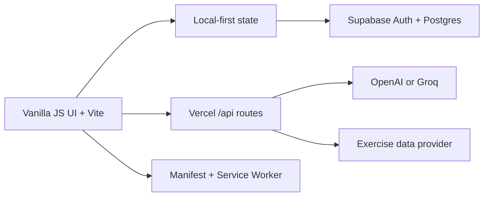

# Discipline OS

> A low-friction personal operating system that helps life stay connected through ordinary days, travel, and recovery—without deleting the powerful tracking tools underneath.

[](https://discipline-os-beige.vercel.app)
[](https://vite.dev/)
[](https://supabase.com/)
[](https://web.dev/explore/progressive-web-apps)

**Live product:** [discipline-os-beige.vercel.app](https://discipline-os-beige.vercel.app)

Discipline OS is not a conventional expense tracker or habit checklist. Its default experience is now a 30-second daily connection ritual: rough spending, body movement, and one meaningful next step. Missing days creates no backfill debt. Returning is progress.

The original battle, account, savings, reward, sport, habit, and AI systems remain available as an expandable expert layer. The interface is optimized for fast daily use on desktop and mobile, with a dark tactical visual system, bilingual UI, local-first saving, cloud synchronization, and installable PWA support.

## Product pillars

| System | What it does |
| --- | --- |
| Life OS Lite | Captures three daily signals in about 30 seconds and becomes the calm default home screen. |
| Return Flow | Detects a tracking gap, removes backfill pressure, and records the act of returning instead of punishing absence. |
| Travel Mode | Replaces unrealistic RM0 pressure with one accepted trip budget and lightweight daily check-ins. |
| Recovery Mode | Reduces the day to minimum viable actions while preserving continuity and honest data. |
| Weekly Coverage | Measures connection across the current week instead of using a fragile all-or-nothing streak. |
| Smart Reminders | Sends an opt-in phone notification only when today's check-in is still missing, then stays quiet after completion. |
| Daily Battle | Records RM0 wins or multiple itemized expenses for any date, including backfills. |
| Battle History | Provides date-range analytics, essential vs. impulse totals, transaction-level editing, and AI reviews. |
| Reward Vault | Turns defended money into controlled reward progress, mystery drops, earned rewards, and outcome tracking. |
| Impulse Firewall | Captures purchase urges before checkout and converts resisted impulses into visible wins. |
| Sports Progression | Tracks training sessions, sports budgets, skill mastery, evidence quality, and AI-calibrated progress. |
| Technique Review | Accepts multiple movement photos for AI-assisted technical feedback and actionable corrections. |
| Habit Battlefield | Manages habits, streaks, recovery, grace passes, rewards, penalties, and AI performance reviews. |
| Savings Ledger | Tracks independent income, expenses, recurring cash flow, forecasts, savings targets, and AI insights. |
| Battle-to-Ledger Sync | Lets the user approve or decline every battle expense before it enters the savings ledger. Decisions remain reversible. |
| Data Control Center | Centralizes record, reward, impulse, and training data management. |

## Key capabilities

### Life OS Lite and anti-dropout design

- Default to one calm home screen instead of presenting the entire system at once.
- Save rough spending, movement, and one meaningful task in a single check-in.
- Treat detailed battle transactions as optional depth, not a daily prerequisite.
- Migrate existing battle and sport records into Lite check-ins without deleting or rewriting source data.
- Save Lite actions locally first, even while offline, and synchronize them when the authenticated cloud connection is available.
- Detect missing days and offer a one-click return flow with no forced backfill.
- Use weekly connection coverage rather than a streak that resets the user's identity after one disruption.
- Pause the creation of new habit penalties by default while preserving all historical penalty records.
- Hide advanced navigation until the user intentionally expands it.
- Switch between normal, travel, and recovery modes without losing historical data.
- Track one total travel budget with spent and remaining amounts instead of judging travel as a failed ordinary day.
- Use a one-tap minimum check-in on exhausted days; it stops further reminders while keeping the record explicitly marked as minimal.
- Opt into Home Screen Web Push reminders on supported iPhone, iPad, Android, and desktop browsers.
- Open the Today screen directly from the lock-screen notification and mirror pending attention with an app-icon badge.
- Choose one daily reminder window and an optional fallback window, protected by a minimum delivery gap.
- Skip all reminders automatically once the current day has any Lite check-in.

### Daily spending and battle history

- Record unlimited individual transactions per day.
- Backfill transactions for any past date without overwriting existing entries.
- Separate essential and impulse spending.
- Automatically recalculate daily totals and summaries.
- Review, edit, delete, or re-run AI analysis at transaction and day level.
- Filter analytics by day, month, year, or custom range.

### Reward and mystery-drop system

- Convert a configurable share of defended money into guilt-free reward capacity.
- Track reward priorities, categories, progress, cooldowns, and outcomes.
- Unlock expanding mystery-drop milestones.
- Require a concrete reward choice before AI assessment.
- Treat already-earned drops as approved reward budgets—not ordinary impulse spending.
- Preserve earned rewards without forcing the user to grind twice.

### Sports and evidence-based skill progression

- Create skill tracks for any sport.
- Log sessions, duration, effort, cost, notes, and measurable evidence.
- Use conservative AI scoring with evidence ceilings.
- Separate practice volume from demonstrated mastery.
- Browse an exercise library with movement media, equipment, and muscle targets.
- Submit multiple action photos for technical review.

### Habit system

- Track flexible daily habits and streaks.
- Backfill recent completions when a habit was completed but logged late.
- Use recovery windows and grace passes.
- Unlock habit reward drops.
- Preserve historical penalty records while Lite mode pauses new penalties by default.
- Analyze habit fit separately from daily execution quality.

### Independent savings ledger

- Record income and expenses without changing battle or reward algorithms.
- Track the exact current balance of each bank, e-wallet, investment account, or cash holding with custom account images.
- Mark any self-created account as a credit card; its signed negative balance deducts directly from the combined account total.
- Move money between accounts without changing income, expenses, or ledger net cash flow, with a reversible transfer history.
- Repay a selected credit card directly from the cash-flow form; repayment is capped at the outstanding debt and can bring the card precisely back to zero.
- Compare actual account assets against ledger net cash flow and expose the reconciliation difference.
- Assign individual ledger entries to the account where money entered or left.
- Configure recurring monthly income, bills, and subscriptions against a specific account.
- Instantly distinguish auto-generated recurring and subscription charges through a dedicated highlighted ledger treatment.
- Search ledger records by date, project, account, type, amount, note, or source and paginate them at 10, 50, or 100 rows per page.
- View total net savings and filtered cash-flow summaries.
- Forecast next-month savings from recurring and recent actual data.
- Set milestone goals and unlock AI-generated rewards.
- Review each battle transaction in a dedicated synchronization center.
- Approve, decline, reverse, or re-sync transactions without duplication.

### Accounts, sync, and installation

- Email/password and Google authentication through Supabase.
- Same-email identity mapping across login methods.
- Cloud state synchronization across devices.
- Local-first fallback through `localStorage`.
- Installable PWA with manifest and service worker.
- Standards-based Web Push through authenticated, per-device subscriptions stored in Supabase.
- Chinese and English interface modes.
- Customizable dark/light themes and accent colors.

## Architecture



## Technology

- **Frontend:** semantic HTML, modular CSS, vanilla JavaScript
- **Build:** Vite 7
- **Backend:** Node.js request handlers and Vercel Functions
- **Authentication and database:** Supabase Auth + Postgres
- **AI providers:** OpenAI or Groq, selected through environment variables
- **Deployment:** Vercel
- **Offline/installability:** Web App Manifest + Service Worker

## Local development

### Requirements

- Node.js 20 or newer
- npm
- A Supabase project for accounts and cloud sync
- An OpenAI or Groq API key for AI features

### Setup

```bash
git clone https://github.com/erictan827/discipline-os.git
cd discipline-os
npm install
cp .env.local.example .env.local
npm run dev
```

Open [http://127.0.0.1:5173](http://127.0.0.1:5173).

### Environment variables

```dotenv
VITE_SUPABASE_URL=https://your-project-ref.supabase.co
VITE_SUPABASE_ANON_KEY=your_supabase-anon-key

AI_PROVIDER=groq
GROQ_API_KEY=your-groq-api-key

# Alternative provider
# AI_PROVIDER=openai
# OPENAI_API_KEY=your-openai-api-key
```

Never commit `.env.local` or any production credentials.

### Supabase schema

Run [`supabase/schema.sql`](supabase/schema.sql) in the Supabase SQL Editor. The schema supports shared application state and identity mapping so Google and password logins using the same email can access the same Discipline OS profile.

## Production build

```bash
npm run build
npm run start
```

The production server is available at [http://127.0.0.1:4173](http://127.0.0.1:4173).

## Deployment

The repository includes [`vercel.json`](vercel.json). Connect the repository to Vercel, configure the environment variables, and deploy the `main` branch.

```bash
vercel --prod
```

## Project structure

```text
.
├── api/                 # Vercel serverless entry points
├── public/              # PWA manifest, service worker, and icons
├── server/              # Shared backend and AI routing logic
├── src/                 # Application logic and modular styles
├── supabase/            # Database schema
├── index.html           # Application shell and dialogs
├── server.js            # Local production server
├── vercel.json          # Vercel deployment configuration
└── vite.config.js       # Vite configuration
```

## Data and privacy

- Secrets are supplied only through environment variables.
- Local state remains available as an offline-friendly fallback.
- Cloud data is scoped through Supabase authentication and row-level security.
- AI requests receive only the context required for the requested analysis.
- Push endpoints and encryption keys remain server-only; notification subscriptions are scoped to the authenticated account and can be disabled per device.
- Generated build output, local state, credentials, and Vercel metadata are excluded from Git.

## Development status

Discipline OS is under active development. Product changes, fixes, and feature releases are documented in [`CHANGELOG.md`](CHANGELOG.md).

## Contributing and security

- See [`CONTRIBUTING.md`](CONTRIBUTING.md) for the expected development workflow.
- See [`SECURITY.md`](SECURITY.md) for responsible vulnerability reporting.

---

Built as a living personal operating system: **Stay connected. Return without debt. Add detail only when it helps.**
